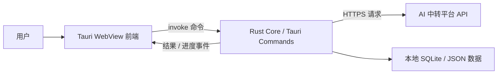

# AI 中转额度消耗检测桌面应用开发方案

## 目标

做一个本地优先的桌面应用，用于检测 AI 中转平台的实际扣费和理论消耗是否存在明显偏差。

核心原则：

- API Key、请求内容、测试结果默认只留在用户本机。
- 测试请求由用户设备直接发往目标中转平台，不经过我们的服务器。
- 不依赖浏览器跨域能力，避免 CORS 导致纯前端不可用。
- 输出可复核的本地报告，让用户对比“理论消耗、接口 usage、平台实际扣费”。

## 为什么选 Tauri

纯前端页面会被浏览器 CORS、预检请求、响应头暴露限制卡住。Tauri 可以保留 Web 前端的开发效率，同时把网络请求、密钥处理、文件读写、报告导出等能力放到本地 Rust 层。

建议采用：

```text
Tauri 桌面壳
  ├─ 前端 UI：配置、进度、图表、报告
  └─ Rust Core：请求中转 API、统计 usage、保存本地数据、导出报告
```

不建议第一版使用云端代理，因为这会让用户的 API Key 和请求内容经过我们的服务器，和“检测平台是否可信”的产品定位冲突。

## 推荐架构



### 前端职责

- 管理测试配置：Base URL、模型、目标金额、单价、测试 prompt、最大请求次数。
- 展示实时进度：累计金额、tokens、请求次数、失败率、耗时。
- 展示请求日志：每次请求的 usage、估算金额、响应摘要、错误信息。
- 管理报告：生成、预览、导出 JSON / CSV / Markdown。
- 不直接向中转平台发请求，不在前端长期保存 API Key。

### Rust Core 职责

- 接收前端测试命令。
- 用本地 HTTP client 直接请求中转平台。
- 支持 OpenAI 兼容接口：
  - `/v1/chat/completions`
  - 后续可扩展 `/v1/responses`
- 解析 `usage` 字段。
- 根据单价表计算理论消耗。
- 控制测试停止条件：
  - 达到目标金额
  - 达到最大请求次数
  - 单次消耗异常
  - 连续失败过多
  - 用户手动停止
- 将过程数据写入本地数据库或本地文件。
- 通过 Tauri event 把进度推给前端。

## 关键功能设计

### 1. 平台配置

每个平台配置包含：

```json
{
  "name": "测试平台",
  "base_url": "https://example.com",
  "api_key_storage": "session|keychain|manual",
  "models": [
    {
      "name": "gpt5.5",
      "input_price_per_1m": 1.25,
      "output_price_per_1m": 10
    }
  ],
  "balance_mode": "manual|api"
}
```

第一版建议只做手动余额输入：

- 测试前余额
- 测试后余额
- 平台实际扣除

余额 API 每个平台差异很大，可以作为第二阶段做适配器。

### 2. 测试流程

```text
1. 用户填写 API Base、API Key、模型、单价、目标消耗
2. 用户填写测试前余额
3. 应用先发起一次小额探测
4. 探测成功后，展示单次 usage 和估算成本
5. 用户确认后开始正式测试
6. Rust Core 循环请求并实时回传进度
7. 达到停止条件后生成本地报告
8. 用户填写测试后余额
9. 应用计算偏差百分比
```

偏差公式：

```text
理论消耗 = sum(prompt_tokens * input_price + completion_tokens * output_price) / 1_000_000
实际扣除 = 测试前余额 - 测试后余额
偏差金额 = 实际扣除 - 理论消耗
偏差比例 = 偏差金额 / 理论消耗
```

### 3. 请求控制

需要避免“为了测 1 美金，结果消耗超太多”。

建议停止策略：

- 每次请求后重新估算剩余目标。
- 如果剩余目标小于最近单次消耗的 35%，自动停止。
- 如果连续 3 次请求失败，自动暂停。
- 如果接口没有返回 `usage`，进入“估算模式”，并提醒用户精度下降。
- 如果 completion token 明显低于预期，降低下一轮最大输出或提示模型拒答。

### 4. 计费模型

第一版只支持最常见的输入/输出 token 单价：

```text
input_price_per_1m
output_price_per_1m
```

第二版再扩展：

- cached input tokens
- reasoning tokens
- image tokens
- audio tokens
- tool call 额外计费
- 平台倍率
- 最小扣费单位
- 人民币 / 美元 / 额度点数换算

### 5. 报告内容

报告应包含：

- 测试时间
- 应用版本
- 平台 Base URL
- 模型名
- 单价配置
- 测试前余额
- 测试后余额
- 理论消耗
- 实际扣除
- 偏差金额
- 偏差比例
- 每次请求 usage 明细
- 错误请求明细
- 响应摘要
- 是否使用接口返回 usage，还是本地估算

报告文案要克制，建议使用：

```text
存在显著账单差异
```

不要直接写：

```text
平台暗扣
```

因为差异可能来自模型映射、倍率、四舍五入、隐藏系统 prompt、失败重试、缓存计费等规则。

## 数据存储

第一版可以使用本地 JSON 文件，后续改 SQLite。

推荐最终数据结构：

```text
projects
  id
  name
  created_at

providers
  id
  name
  base_url
  created_at

test_runs
  id
  provider_id
  model
  target_usd
  input_price_per_1m
  output_price_per_1m
  balance_before
  balance_after
  estimated_cost
  actual_cost
  diff_cost
  diff_ratio
  status
  created_at
  completed_at

request_logs
  id
  test_run_id
  request_index
  status
  latency_ms
  prompt_tokens
  completion_tokens
  total_tokens
  estimated_cost
  response_summary
  error_message
  created_at
```

API Key 不建议进入普通数据库。选项：

- 默认只在内存中使用，关闭应用即清空。
- 可选保存到系统 Keychain / Credential Manager。
- 不允许明文写入报告。

## 安全设计

### Tauri 权限

Tauri v2 使用 capabilities 控制前端可访问的本地能力。应用应该只暴露必要命令，例如：

- `probe_provider`
- `start_test_run`
- `stop_test_run`
- `list_test_runs`
- `export_report`

不开放通用 shell、任意文件读写、任意命令执行。

### 网络访问

所有外部请求都在 Rust Core 内完成，前端不直接请求目标平台。

需要做的限制：

- 校验 Base URL 必须是 `https://`，开发模式可允许 `http://localhost`。
- 禁止请求本机敏感地址段，避免 SSRF 风险：
  - `127.0.0.0/8`
  - `10.0.0.0/8`
  - `172.16.0.0/12`
  - `192.168.0.0/16`
  - metadata 地址
- 提供“高级模式”时明确提示风险。

### 日志脱敏

日志和报告中必须脱敏：

- API Key
- Authorization header
- 完整 prompt，可选保存
- 完整响应内容，可选保存

默认只保存响应前 200 字摘要和 usage。

## UI 页面规划

### 1. 首页 / 测试台

首屏就是可用工具，不做营销页。

布局：

- 左侧：平台配置和测试参数
- 右侧：实时消耗仪表
- 下方：请求日志表格

### 2. 历史测试

展示历史 run：

- 平台
- 模型
- 测试时间
- 理论消耗
- 实际扣除
- 偏差比例
- 状态

### 3. 报告详情

展示单次测试完整报告，可导出：

- JSON
- CSV
- Markdown

### 4. 设置

- 默认币种
- 默认单价表
- 是否保存 prompt
- 是否保存 API Key 到系统凭据
- 请求超时
- 并发数，第一版建议固定为 1

## 技术选型

建议：

- 桌面框架：Tauri v2
- 前端：React + TypeScript + Vite
- 样式：CSS Modules 或 Tailwind，二选一即可
- 图表：ECharts 或 Recharts
- Rust HTTP：reqwest
- 本地数据库：SQLite
- 序列化：serde
- 时间处理：chrono
- 导出：Rust 生成 JSON/CSV/Markdown，前端负责预览

第一版也可以继续复用当前静态页面逻辑，把请求部分从 `fetch` 改成 Tauri `invoke`。

## 模块划分

```text
src/
  pages/
    TestWorkbench.tsx
    History.tsx
    ReportDetail.tsx
    Settings.tsx
  components/
    ProviderForm.tsx
    CostMeter.tsx
    RequestLogTable.tsx
    ReportSummary.tsx
  services/
    tauriApi.ts
    pricing.ts
    report.ts

src-tauri/
  src/
    commands/
      provider.rs
      test_run.rs
      report.rs
    core/
      openai_compat.rs
      cost.rs
      runner.rs
      safety.rs
    storage/
      db.rs
      migrations.rs
    lib.rs
```

## 版本路线

### MVP

- Tauri 桌面应用壳
- 单平台 OpenAI 兼容接口测试
- 手动输入前后余额
- 单价手动配置
- 串行请求
- 实时 usage 统计
- JSON / Markdown 报告导出
- API Key 仅内存保存

### v0.2

- 历史测试记录
- SQLite 存储
- 多平台配置
- 系统 Keychain 保存 API Key
- CSV 导出
- 更好的错误诊断

### v0.3

- 平台余额 API 适配器
- 模型价格库
- 汇率和倍率规则
- cached tokens / reasoning tokens 支持
- 测试报告签名或校验 hash

### v1.0

- Windows / macOS 签名安装包
- 自动更新
- 完整隐私说明
- 开源核心审计逻辑
- 可分享但脱敏的检测报告

## 风险与应对

### 平台不返回 usage

应对：

- 降级为本地 tokenizer 估算。
- 报告中明确标记“估算模式”。
- 不把估算模式结果用于强结论。

### 模型名被平台映射

应对：

- 记录响应中的实际 `model` 字段。
- 如果请求模型和响应模型不同，报告中标红。

### 平台有隐藏倍率或最小扣费单位

应对：

- 支持用户填写倍率。
- 支持最小扣费单位配置。
- 报告中列出计费假设。

### 用户误填价格

应对：

- 报告显示完整单价假设。
- 后续加入模型价格模板。

### 测试成本失控

应对：

- 默认先做小额探测。
- 每次请求后判断剩余目标。
- 默认串行请求。
- 用户可随时停止。

## 开发顺序

1. 初始化 Tauri v2 + React + TypeScript 项目。
2. 把当前静态页面迁移成前端组件。
3. 实现 Rust 命令 `probe_provider`。
4. 实现 Rust 测试 runner 和停止逻辑。
5. 实现前端实时进度展示。
6. 实现本地报告导出。
7. 增加历史记录。
8. 增加安全限制和脱敏。
9. 打包 macOS / Windows 测试版。

## 官方参考

- Tauri v2 capabilities 用于限制前端可访问的本地能力：<https://v2.tauri.org.cn/security/capabilities/>
- Tauri runtime authority 会校验 WebView origin 和命令权限：<https://v2.tauri.app/security/runtime-authority/>
- Tauri 前端调用 Rust 命令可使用 `invoke`，Rust 命令也能访问原始请求体和请求头：<https://v2.tauri.org.cn/develop/calling-rust/>
- Tauri sidecar 可嵌入外部二进制，但本项目 MVP 更建议直接用 Rust Core，不需要 sidecar：<https://tauri.app/develop/sidecar/>
